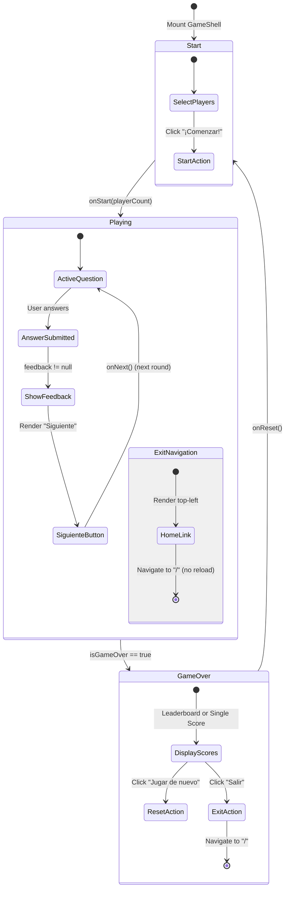
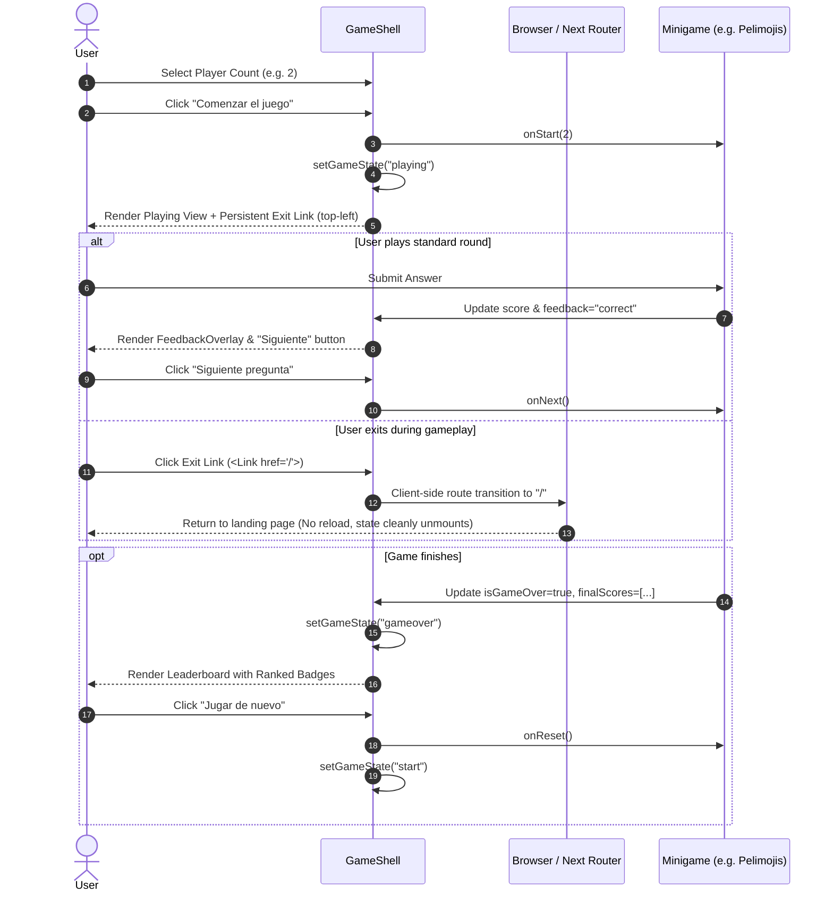

# Design: metele-fase5-gameshell-hybrid

## Technical Approach

Phase 4 introduced the dark glass aesthetic on the landing page (`#1D1D1B`, `landing-dot-grid`, `bg-[#181816]/95`, `backdrop-blur-xl`, `border-white/10`, `landing-gradient-text`, `variant="landing"`). However, minigames and the shared `GameShell` container remained on bright comic palettes (`bg-comic-yellow`, `bg-comic-red`, pure white high-contrast cards), causing an abrupt visual disconnect when transitioning from the landing page into any game.

This design implements the "Hybrid" aesthetic across `GameShell`, `Scoreboard`, `FeedbackOverlay`, and minigame root containers (specifically sanitizing `app/games/pelimojis/page.tsx`). The hybrid style preserves high-energy comic attributes (comic drop-shadows `shadow-comic`, bold typography `font-display`, uppercase badges, dynamic spring animations) while mounting them on dark glass surfaces (`#181816`/95, white borders with subtle opacity, radiant gradient accents from `metele-pink` to `metele-orange`).

Additionally, this change solves the navigation trap in full-screen games by establishing persistent client-side exit navigation (`<Link href="/">`) in the top-left corner during active gameplay, enabling immediate return to the minigames catalog without page reload.

---

## Architecture Decisions

### Decision 1: Background and Container Palette (Dark Canvas + Dot-Grid)

- **Choice**: Replace legacy `bg-comic-yellow` (start & playing) and `bg-comic-red` (game over) with `#1D1D1B` / `bg-comic-black text-white`, layered with an absolute `landing-dot-grid pointer-events-none` utility overlay.
- **Alternatives considered**:
  - *Keep comic yellow/red backgrounds*: Rejected because it creates severe visual glare and clashes with the Phase 4 dark landing aesthetic.
  - *Flat black without texture*: Rejected because flat `#000000` loses the tactile comic book texture and feels unfinished compared to the landing page.
- **Rationale**: The `#1D1D1B` background paired with `landing-dot-grid` establishes visual continuity between the landing catalog and the game views while maintaining comic pop texture.

### Decision 2: Central Cards (Dark Glassmorphism)

- **Choice**: Transition start and game-over dialog cards to dark glass containers:
  `bg-[#181816]/95 border-2 border-white/10 backdrop-blur-xl shadow-2xl rounded-3xl p-8 max-w-2xl w-full text-center relative z-10`.
  Game titles use `landing-gradient-text` (`linear-gradient(110deg, var(--color-metele-pink), var(--color-metele-orange))`).
- **Alternatives considered**:
  - *Pure white cards with 4px black borders*: Rejected as they create high harshness against dark canvas.
  - *Fully translucent cards (`bg-white/10`)*: Rejected because game instructions and score text require high opacity for contrast and readability.
- **Rationale**: `bg-[#181816]/95` with `backdrop-blur-xl` delivers the modern glass feel while guaranteeing WCAG contrast compliance for text and controls.

### Decision 3: Persistent Client-Side Exit Navigation in Playing State

- **Choice**: Render a fixed navigation link in the top-left corner (`fixed top-4 left-4 z-50`) during `gameState === "playing"`:
  ```tsx
  <Link
    href="/"
    aria-label="Volver al inicio"
    className="fixed top-4 left-4 z-50 p-3 rounded-xl bg-[#181816]/90 border-2 border-white/20 text-white/80 hover:text-white hover:border-white/40 shadow-comic backdrop-blur-md flex items-center gap-2 transition-all group"
  >
    <Home className="w-5 h-5 group-hover:scale-110 transition-transform" />
    <span className="hidden sm:inline font-display text-sm tracking-wider uppercase">Inicio</span>
  </Link>
  ```
- **Alternatives considered**:
  - *Window `history.back()` button*: Unreliable if the user landed on the game directly from an external link or bookmark.
  - *Full page reload button (`window.location.href = "/"`)*: Destroys single-page app responsiveness and resets Next.js client cache.
  - *Exit confirmation modal on every click*: Adds unnecessary friction for casual minigames.
- **Rationale**: Next.js `<Link href="/">` ensures instantaneous client-side transition to the homepage, fixing full-screen game trapping without layout disruption.

### Decision 4: Tactile & Glowing Player Count Selector

- **Choice**:
  - Inactive count buttons: `bg-white/5 hover:bg-white/10 text-white/80 border-2 border-white/10 rounded-xl transition-all font-display text-2xl w-16 h-16 flex items-center justify-center`
  - Active count button: `bg-gradient-to-r from-metele-pink to-metele-orange text-white border-2 border-white/40 shadow-comic transform -translate-y-1 font-display text-2xl w-16 h-16 flex items-center justify-center`
  - Action buttons: "Volver" button uses `ComicButton` with `variant="landing"` and `aria-label="Volver al inicio"`. "¡Comenzar!" button uses `ComicButton` `size="lg"` with `aria-label="Comenzar el juego"`.
- **Alternatives considered**:
  - *Standard HTML dropdown*: Inaccessible on touch screens, lacks comic fun factor.
  - *Solid comic blue button*: Inconsistent with the metele pink/orange gradient system.
- **Rationale**: The combination of subtle glass for inactive states and radiant gradients for active selection provides clear visual feedback and matches the landing brand.

### Decision 5: Ranked Leaderboard on Game Over

- **Choice**: Refactor the game over leaderboard into ranked dark glass rows with distinct tier badges:
  - **#1**: `bg-metele-yellow/20 text-metele-yellow border border-metele-yellow/40 shadow-[0_0_12px_rgba(255,214,0,0.2)]`
  - **#2**: `bg-metele-pink/20 text-metele-pink border border-metele-pink/40`
  - **#3**: `bg-metele-orange/20 text-metele-orange border border-metele-orange/40`
  - **#4+**: `bg-white/5 text-white/60 border border-white/10`
  Row container: `bg-white/5 border border-white/10 p-3 rounded-xl backdrop-blur-sm flex justify-between items-center`.
  Player scores highlighted with `font-display text-2xl text-metele-yellow`.
- **Alternatives considered**:
  - *Monochrome gray list*: Boring, lacks celebratory excitement for party games.
  - *External chart library*: Unnecessary bundle bloat for basic score arrays.
- **Rationale**: Tier badges highlight podium positions (#1, #2, #3) instantly, reinforcing competitive party gameplay.

### Decision 6: Scoreboard & FeedbackOverlay Dark Glass Evolution

- **Scoreboard**:
  - Container: `bg-[#181816]/90 border-2 border-white/20 shadow-comic backdrop-blur-md text-white p-3 md:p-4 rounded-xl min-w-[5.5rem] text-center`.
  - Score value: `font-display text-3xl md:text-4xl text-metele-yellow`.
  - High score badge: `bg-[#181816]/90 border-2 border-white/20 shadow-comic backdrop-blur-md text-white p-3 md:p-4 rounded-xl min-w-[5.5rem] text-center hidden md:block`, high score value in `text-metele-pink`.
- **FeedbackOverlay**:
  - Keep high-energy color flashes: `bg-green-500/85` (correct) and `bg-red-500/85` (incorrect) with `backdrop-blur-sm`.
  - Inner card: `bg-[#181816]/95 border-2 border-white/20 p-8 rounded-3xl shadow-[12px_12px_0px_0px_rgba(0,0,0,1)] text-center text-white`.
  - Headings: `text-metele-green` for correct and `text-comic-red` for incorrect, paired with white subtitle text.
- **Rationale**: Keeps the sensory punch of full-screen correct/incorrect feedback while modernizing the card chrome with dark glass aesthetics.

### Decision 7: Minigame Container Harmonization (Pelimojis)

- **Choice**:
  - Replace `bg-comic-yellow` on Pelimojis root container (`app/games/pelimojis/page.tsx:193`) with `bg-comic-black text-white`.
  - Replace `bg-comic-yellow` on Pelimojis turn overlay (`app/games/pelimojis/page.tsx:178`) with `bg-[#1D1D1B]/95 backdrop-blur-md border-l-4 border-metele-pink` and a dark glass turn badge.
  - Shift player badge from `top-4 left-4` to `top-4 left-28` to avoid overlapping the new GameShell exit button (`top-4 left-4`).
  - Upgrade emoji container card from white/black to dark glass `bg-[#181816]/80 border-2 border-white/10 rounded-3xl shadow-comic-lg backdrop-blur-md`.
- **Rationale**: Pelimojis was the primary game with hardcoded full-screen yellow canvas. Harmonizing it guarantees zero yellow flashes during navigation and gameplay.

---

## State & Navigation Flow

### State Lifecycle Diagram



### Navigation Sequence Diagram



---

## File Changes

| File | Action | Description |
|------|--------|-------------|
| `components/game/GameShell.tsx` | Modify | Implement dark glass styling on start, playing, and game-over states. Add persistent exit `<Link href="/">` during playing state. Refactor player selector and leaderboard badges. |
| `components/game/Scoreboard.tsx` | Modify | Update score and high-score cards to dark glass styling (`bg-[#181816]/90`, `border-white/20`, `shadow-comic`) with vibrant metele typography. |
| `components/ui/FeedbackOverlay.tsx` | Modify | Update modal dialog card to dark glass styling (`bg-[#181816]/95`) while preserving high-contrast green/red backdrop flash. |
| `app/games/pelimojis/page.tsx` | Modify | Eliminate hardcoded `bg-comic-yellow` backgrounds, harmonize turn change overlay and emoji card with dark glass theme, and adjust header offset to prevent exit link collision. |
| `components/game/GameShell.test.tsx` | Modify | Add automated tests verifying the presence and accessible attributes of the persistent exit navigation link in the playing state, while preserving 100% pass rate on existing tests. |

---

## Interfaces / Contracts

### GameShell Interface (Unchanged contract, strictly backward-compatible)

```typescript
export interface GameShellProps {
    title: string;
    instructions: string;
    onStart?: (players: number) => void;
    onReset?: () => void;
    children: React.ReactNode;
    score: number;
    finalScores?: { name: string; score: number }[];
    isGameOver: boolean;
    feedback: "correct" | "incorrect" | null;
    onNext: () => void;
    disableFeedbackOverlay?: boolean;
    fullScreen?: boolean;
    hideScoreboard?: boolean;
}
```

### Leaderboard Rank Badge Helper Contract

```typescript
function getRankBadgeStyles(rank: number): { badge: string; text: string } {
    switch (rank) {
        case 1:
            return {
                badge: "bg-metele-yellow/20 text-metele-yellow border-metele-yellow/50 shadow-[0_0_12px_rgba(255,214,0,0.25)]",
                text: "text-metele-yellow font-black",
            };
        case 2:
            return {
                badge: "bg-metele-pink/20 text-metele-pink border-metele-pink/40",
                text: "text-metele-pink font-bold",
            };
        case 3:
            return {
                badge: "bg-metele-orange/20 text-metele-orange border-metele-orange/40",
                text: "text-metele-orange font-bold",
            };
        default:
            return {
                badge: "bg-white/5 text-white/60 border-white/10",
                text: "text-white/80",
            };
    }
}
```

---

## Testing Strategy

| Layer | What to Test | Approach |
|-------|-------------|----------|
| **Unit / Component** | `GameShell` start screen renders hybrid background (`landing-dot-grid`), dark glass card, player count selector, and accessible buttons (`"Volver al inicio"`, `"Comenzar el juego"`). | Vitest + React Testing Library in `components/game/GameShell.test.tsx`. |
| **Unit / Component** | `GameShell` playing screen renders dark container and persistent exit link pointing to `"/"` with accessible name `"Volver al inicio"`. | Vitest + React Testing Library in `components/game/GameShell.test.tsx`. |
| **Unit / Component** | `GameShell` game-over screen renders ranked badges for `#1`, `#2`, `#3` when `finalScores` is provided. | Vitest + React Testing Library in `components/game/GameShell.test.tsx`. |
| **Unit / Component** | `Scoreboard` renders dark glass container with vibrant score accents. | Vitest component tests. |
| **Integration** | Full game flow in `Pelimojis` mounts without yellow background classes and responds to turn changes and game resets. | Vitest component test for `app/games/pelimojis/page.tsx`. |
| **Regression** | Ensure all 19 existing test suites (`npm test`) continue to pass at 100%. | Automated test runner execution. |

---

## Threat Matrix

| Boundary / Risk Area | Status | Safe / Failure Behavior | Planned RED Tests |
|----------------------|--------|--------------------------|-------------------|
| Client-side exit routing | **Applicable** | Uses Next.js `<Link href="/">` with hardcoded static destination `"/"`. No user input or dynamic URL injection possible. Cannot navigate to arbitrary protocols or unvetted domains. | Assert `<a href="/">` is present with `aria-label="Volver al inicio"` during `playing` state in `GameShell.test.tsx`. |
| Subprocess / Shell Execution | **N/A** | Pure React/Next.js frontend UI components; no shell, process, or system execution. | None. |
| VCS / PR Automation | **N/A** | No automated VCS branching or commit modifications in component code. | None. |
| Executable classification | **N/A** | No executable binaries or file-type inspection. | None. |

---

## Review Budget & Delivery Strategy

### Line Count Estimation by File

| File | Est. Additions | Est. Deletions | Est. Delta | Rationale |
|------|----------------|----------------|------------|-----------|
| `components/game/GameShell.tsx` | +65 | -45 | ~110 lines | Dark glass redesign of start, playing, gameover screens, exit link, player selector, and leaderboard badges. |
| `components/game/Scoreboard.tsx` | +15 | -10 | ~25 lines | Dark glass container and metele text accent tokens. |
| `components/ui/FeedbackOverlay.tsx` | +12 | -8 | ~20 lines | Dark glass modal card styling and refined typography. |
| `app/games/pelimojis/page.tsx` | +20 | -15 | ~35 lines | Removal of `bg-comic-yellow`, dark glass turn change overlay, header offset. |
| `components/game/GameShell.test.tsx` | +20 | -2 | ~22 lines | Addition of test assertions for exit link and hybrid attributes. |
| **Total Authored Changes** | **~132** | **~80** | **~212 lines** | **Well within the 400-line review budget** |

### Review Workload Guard
- **Budget Threshold**: 400 changed lines (`additions + deletions`).
- **Estimated Total**: ~212 lines.
- **Decision needed before apply**: No.
- **Chained PRs recommended**: No.
- **400-line budget risk**: Low.
- **Delivery Strategy**: `single-pr` (self-contained, focused styling and navigation refactor).

---

## Migration / Rollout

No database migration, environment variable changes, or infrastructure rollout required.
The changes are strictly front-end React components and Tailwind styling. Rollout is instantaneous upon merging the single PR.

---

## Open Questions

- None. All requirements, visual tokens, and navigation flows are fully specified.
